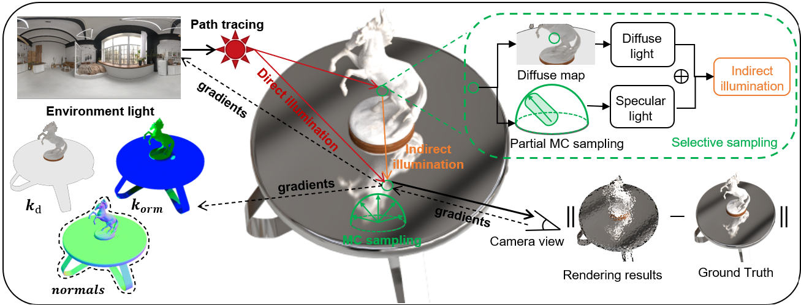

# Ref-MC2-Code

**This repository is the official implementation repository of the paper, Multi-times Monte Carlo Rendering for Inter-reflection Reconstruction.**

**NeurIPS 2024**

Tengjie Zhu<sup>\*</sup>, Zhuo Chen<sup>\*</sup>, Jingnan Gao, [Yichao Yan](https://daodaofr.github.io/), [Xiaokang Yang](https://english.seiee.sjtu.edu.cn/english/detail/842_802.htm)

Shanghai Jiao Tong University

<sup>*</sup>Equal Contribution

### [Project Page](https://zhutengjie.github.io/Ref-MC2/) | [Paper (ArXiv)](https://arxiv.org/abs/2407.05771) 




**The complete code is coming soon.**

The code provides:

- [x] Training code for learning PBR materials and environment light
- [ ] Training code for learning the geometry

# News

- **[9/26/2024]** Ref-MC2 has been accepted by NeurIPS 2024.

# Install

Tested in Anaconda3 with Python 3.9 and cuda 11.3, 11.6, 11.8 on the following GPUs: RTX3090, A5000 and A6000

Note that your *torch* version must correspond to your *cuda* version. *cudnn* does not need to be installed.

```
git clone https://github.com/zhutengjie/Ref-MC2-Code.git
conda create -n refmc2 python=3.9
conda activate refmc2
pip install torch==1.12.1+cu113 torchvision==0.13.1+cu113 torchaudio==0.12.1 --extra-index-url https://download.pytorch.org/whl/cu113
cd learning_materials
pip install -r requirements.txt
pip install git+https://github.com/NVlabs/nvdiffrast/
pip install --global-option="--no-networks" git+https://github.com/NVlabs/tiny-cuda-nn#subdirectory=bindings/torch
imageio_download_bin freeimage
pip install kaolin==0.15.0 -f https://nvidia-kaolin.s3.us-east-2.amazonaws.com/torch-1.12.1_cu113.html
```

# Data


In our material learning code, we provide our two sample geometries under the geo folder. One is **materials** in [NeRF synthetic dataset](https://drive.google.com/uc?export=download&id=18JxhpWD-4ZmuFKLzKlAw-w5PpzZxXOcG), and the other is **coral** in the [NeRO](https://github.com/liuyuan-pal/NeRO?tab=readme-ov-file) dataset. We have converted the format of the NeRO real dataset into (.**json**) format, the code for converting format will also be provided later.


Please download the data set and organize it as follows：
```
learning_materials
|-- data
    |-- nero
        |-- coral 
            ...
    |-- nerf_synthetic
        |-- materials
            ...
```

# Train

```
python train.py --config configs/nerf_materials.json
```

The results will be saved in the out folder.
If you want to run offline on a specific GPU:
```
CUDA_VISIBLE_DEVICES=0 nohup python -u train.py --config configs/nerf_materials.json > output.log 2>&1 &
```
# Citation

```
@InProceedings{zhu2024multitimesmontecarlorendering,
   author = {Tengjie Zhu and Zhuo Chen and Jingnan Gao and Yichao Yan and Xiaokang Yang},
   title = {Multi-times Monte Carlo Rendering for Inter-reflection Reconstruction},
   year = {2024},
   booktitle = {NeurIPS},
}
```

# Acknowledgement

We have borrowed codes from the following repositories, and thanks for their excellent work.

+ **[Nvdiffrecmc](https://github.com/NVlabs/nvdiffrecmc)**
+ **[FlexiCubes](https://github.com/nv-tlabs/FlexiCubes)**
+ **[Nvdiffrec](https://github.com/NVlabs/nvdiffrec)**
